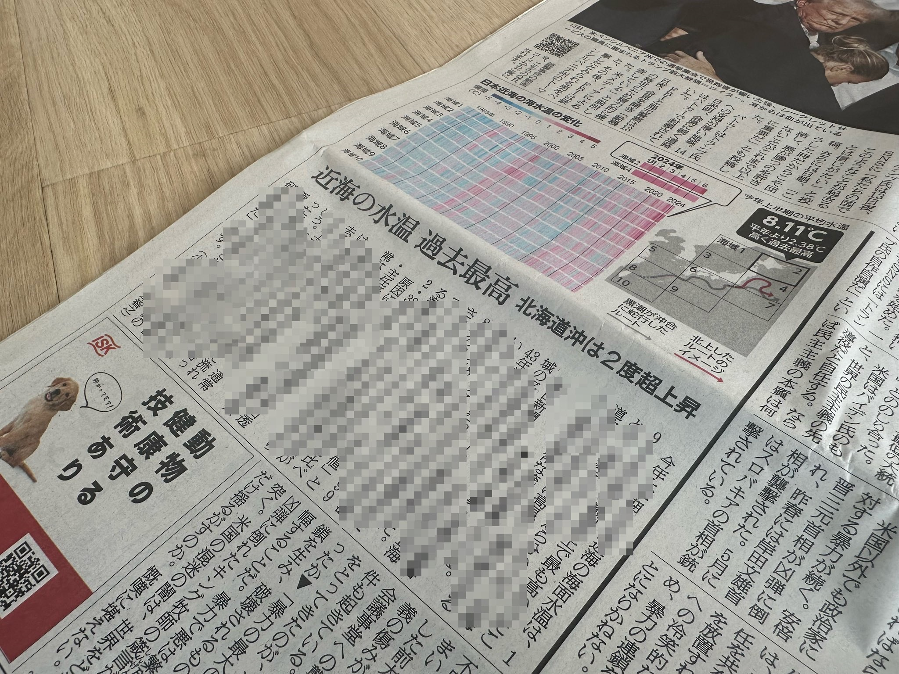
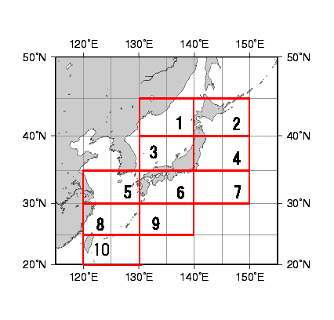
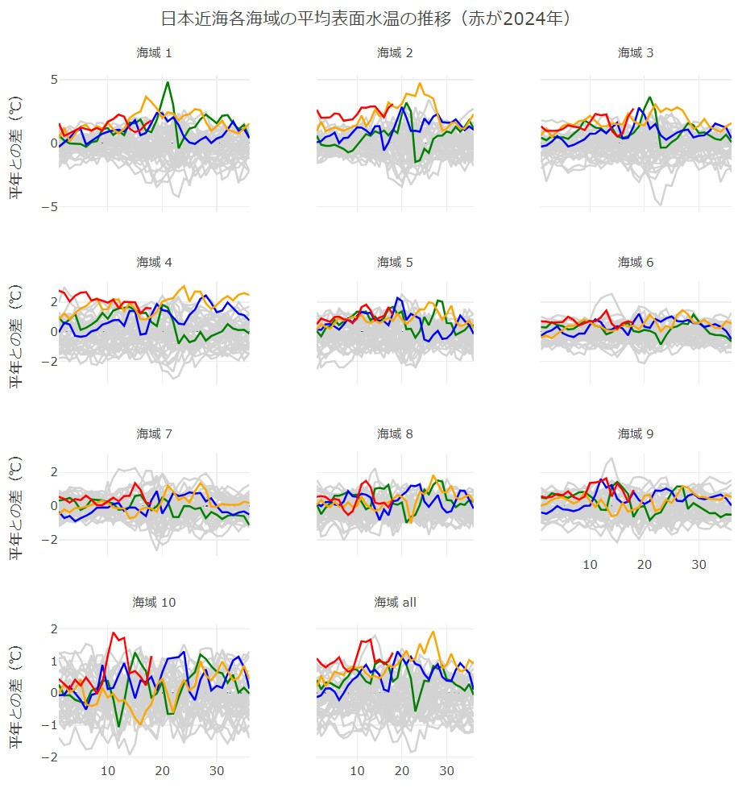
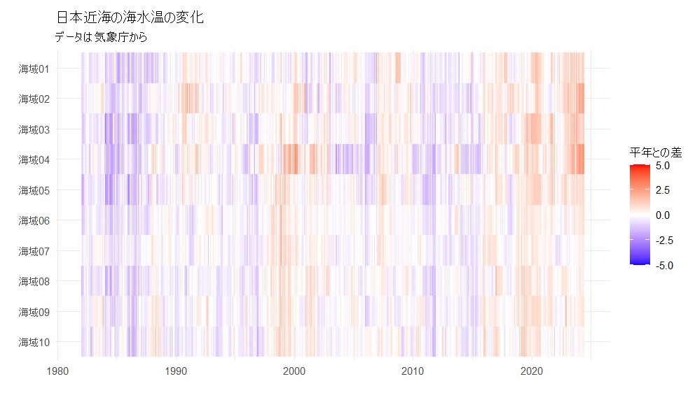

# 日本近海の水温がとっても高い

<div align="right">
朝日新聞デジタル企画報道部　小宮山亮磨  <br>
@ryomakom  <br>
2024/7/15  </div>


朝日新聞デジタルは2024年7月14日、「日本近海の水温、今年前半は過去最高　北部で顕著、異常な黒潮影響か」との[記事](https://digital.asahi.com/articles/ASS7D45LMS7DULLI00LM.html)を配信しました（紙の新聞では翌15日の朝刊1面と社会面に掲載しました）。



日本近海の海域における平均水面温度が、2024年の上半期は過去43年の観測史上もっとも高くなったことを紹介するとともに、このことが地上の暑さ（いやぁ、今年もキツいですね……）に及ぼす影響などを、同僚らと一緒に読み解いた記事です。

データは人工衛星や海面のブイ、船舶などで計測したデータからはじき出したものを、気象庁から提供していただきました。[このサイト](https://www.data.jma.go.jp/kaiyou/data/db/kaikyo/series/wnpsst_series1.html)にあるとおり、北は北海道、南は台湾東側まで、日本近海を10海域に分けて、それぞれの平均水温がおおよそ10日ごとに（つまり月に3回、年間だと36回）記録されています。

10海域はこんなふうに分かれています。



データは平均水温をそのまま記録したものと、それぞれの水温を平年（というのは1991年から2020年までの平均だそうです）と比較した「偏差」と2パターンあります。後者の「偏差」がどのように推移してきたかを海域ごとに示したグラフが、[このサイト](https://ryomakom.github.io/ocean_temp/)から見られます。年間36回の何番目のデータだったのかを横軸に、縦軸に平年との差を示しています。こんな感じです。




1982～2020年の分については折れ線をすべてグレーにし、2021年以降の4年分については色をつけて示しました。北寄りの海域、とくに北海道東側に位置する「海域2」や三陸地方沖の「海域3」での温度上昇が近年激しいこと、一方で南のほうにある海域ではさほどでもないことが読み取れます。PCからであれば、それなりに見やすくなっているかと思います（スマホのかたはご容赦を）。

以下のコードは、このグラフと、紙面に載ったヒートマップ（の簡易版）を描くためのものです。

```{r setup, include=FALSE}

library(tidyverse)
library(plotly)
library(lubridate)

```

データの読み込み

```{r data, include=FALSE}

temps_dev <- read.table("data/水温偏差.txt",
                        header = TRUE, sep = "", fill = TRUE, strip.white = TRUE, row.names = NULL) %>%
  slice(-1) %>%
  as_tibble() %>% 
  rename(ym = row.names, ten_days = region) %>% 
  mutate(year=as.double(str_sub(ym,1,4)),
         time=(as.double(str_sub(ym,5,6))-1)*3+ten_days) %>% 
  select(-ym,-ten_days) %>% 
  select(year,time,everything())
```

ヒートマップを描く

```{r heatmap, include=FALSE}

temps_dev %>% 
  mutate(time2 = str_c(year, "-", ifelse(str_count(time) == 1, str_c("0", time), time))) %>% 
  select(-time, -year) %>% 
  rename(time = time2) %>% 
  mutate(time = ymd(str_c(time, "-01"))) %>%  # lubridateパッケージを使用
  pivot_longer(cols = -c(time), names_to = "area", values_to = "temp") %>% 
  filter(area != "all") %>% 
  mutate(area = str_replace(area, "X", "海域")) %>% 
  mutate(area = ifelse(str_count(area) == 3, str_c("海域", "0", str_sub(area, 3)), area)) %>% 
  mutate(area = factor(area, levels = rev(unique(area)))) %>%  # 因子レベルを逆にする
  ggplot(aes(time, area, fill = temp)) +
  geom_tile() +
  scale_x_date(limits = c(ymd("1982-01-01"), ymd("2024-07-01")), date_labels = "%Y") +  # 横軸の範囲を設定
  scale_fill_gradient2(low = "blue", mid = "white", high = "red", midpoint = 0, limits = c(-5, 5)) +
  theme_minimal() +
  labs(title = "日本近海の海水温の変化",
       subtitle = "データは気象庁から",
       x = "", y = "", fill = "平年との差")


```




動く折れ線グラフを作る

```{r linechart, include=FALSE}

# グラフのリストをつくる
temps_dev_list <- lapply(variables, function(var_name) {
  p <- plot_ly() %>%
    add_trace(
      data = temps_dev %>%
        mutate(color_group = ifelse(year == 2024, "red",
                             ifelse(year == 2023, "orange",
                             ifelse(year == 2022, "blue",
                             ifelse(year == 2021, "green", "lightgray"))))),
      x = ~time, y = as.formula(paste("~", var_name)), type = 'scatter', mode = 'lines',
      line = list(color = ~color_group), name = ~as.character(year),
      group = ~year,
      showlegend = FALSE
    ) %>%
    layout(
      xaxis = list(title = ""),
      yaxis = list(title = "平年との差（℃）")
    )
  # アノテーションを追加してタイトルを手動で設定
  p <- layout(p, annotations = list(
    x = 0.5,
    y = 1.1,
    text = paste("海域", str_replace(var_name,"X","")),
    showarrow = FALSE,
    xref = "paper",
    yref = "paper",
    xanchor = "center",
    yanchor = "bottom",
    font = list(size = 12)
  ))
  return(p)
})

# subplotでグラフを並べる
temps_dev_plot <- subplot(temps_dev_list,
                      nrows = ceiling(length(variables) / 3),
                      shareX = TRUE,
                      shareY = TRUE,
                      titleX = TRUE,
                      titleY = TRUE,
                      margin = 0.05) %>%
  layout(
    margin = list(t = 100),  # 全体の上部に余白を追加
    title = "日本近海各海域の平均表面水温の推移（赤が2024年）",
    annotations = list(
      list(
        x = 0.5,
        y = 1.05,
        text = "",
        showarrow = FALSE,
        xref = "paper",
        yref = "paper",
        xanchor = "center",
        yanchor = "top",
        font = list(size = 14)
      )
    )
  )


# 出力する
temps_dev_plot

```

以上。
